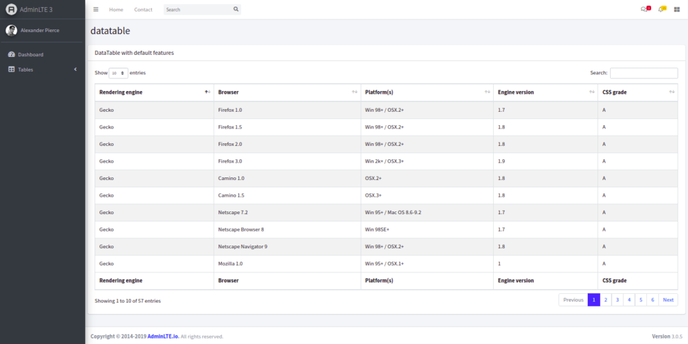

# Memasangkan Template dengan Laravel Blade
 

Challenge kali ini kalian ditantang untuk memasangkan template Admin LTE ke project Laravel kalian.
  

## Pasang Template Admin LTE
 
Pasangkan template adminLTE pada project Laravel tugas. Lakukan seperti pada video tutorial mulai dari membuat master template, copy paste asset ke folder public dan terakhir merapikan.
  
link adminLTE : <a href="https://github.com/ColorlibHQ/AdminLTE/releases">admin-LTE</a>
  
 

## Extend Template 
  

### Buat Route
 
Pada project kali ini buatlah dua route : '/table' dan '/data-tables.
   

#### Route '/table'
 
Route '/table' berisi halaman yang menampilkan tabel berikut:  
<a href="source/blade/table.html" download>table.html</a>
   

#### Route '/table'
 
Route '/table' berisi halaman yang menampilkan tabel berikut:  
<a href="source/blade/datatables.html" download>datatables.html</a>
   

Pada halaman data-tables kita membutuhkan asset CSS dan JS dari plugin data-tables. asset Javascript di antaranya datatables dan datatables-bs4 berikut ini script yang dibutuhkan (sesuaikan alamat asset dengan alamat yang ada di dalam project public). 
<a href="source/blade/js.js" download>js.js</a>
  

Script dari datatables hanya dibutuhkan di view yang menampilkan route '/data-tables' dan tidak dibutuhkan di route '/' . gunakan directive @stack dan @push dari Blade untuk membuat kondisi tersebut terpenuhi.
 
 
 

Output table "/table"

  

Output datatable "/data-table"
