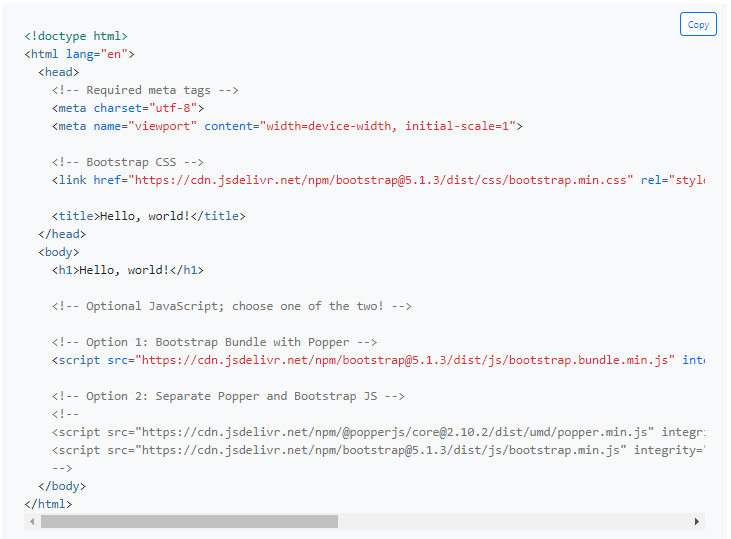

# Tugas Bootstrap
 

## Target
- Membuat layout HTML dengan CSS Bootstrap  

## Petunjuk Pengerjaan  

### 1. Menambahkan Bootstrap pada HTML 
Buatlah sebuah file html dan copy semua code pada link dibawah.
[https://getbootstrap.com/docs/5.1/getting-started/introduction/](https://getbootstrap.com/docs/5.1/getting-started/introduction/)
  

Cara lain menambahkan CSS Bootstrap ke dalam project HTML adalah dengan mendownload file CSS dari link [https://getbootstrap.com/docs/5.1/getting-started/download/](https://getbootstrap.com/docs/5.1/getting-started/download/) lalu simpan ke dalam folder project HTML. Memasangkan CSS Bootstrap ke dalam HTML sama dengan memasangkan file CSS biasa ke halaman HTML seperti pada materi kemarin.‌  

### 2. Membaca Layout / Wireframe
Kita akan membuat mini e-commerce. Berikut ini adalah layout dari website yang ingin kita buat:
  

Beberapa ketentuan:‌
- untuk Bagian Jumbotron boleh menggunakan gambar statis saja atau slider atau carousel 
- section dan feature bisa menggunkan list group
- Box ITEM1 dst adalah Card yang memuat gambar (silakan cari component Card di Bootstrap). Di dalam Card tersebut harus memuat informasi harga, deskripsi, dan button Tambahkan ke Keranjang.
- External Link bisa diisi gambar iklan atau form inputan login
  

### 3. Implementasi Layout pada HTML
Mengimplementasikan layout dengan Bootstrap Setelah melihat layoutnya, coba implementasikan Bootstrap ke dalam index.html yang sudah kita buat agar tampilannya sesuai. Sangat dibolehkan untuk berkreasi menggunakan component atau class yang tersedia di Bootstrap.
‌

