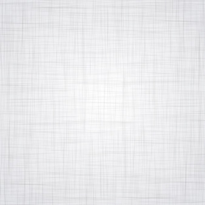

# Tugas CSS
 
layouting-html-css‌   

## Target
- Membuat layout HTML dengan CSS  

## Petunjuk Pengerjaan 
Ikutilah langkah-langkah pengerjaan di bawah ini:‌  

### 1. Membuat File HTML 
Buatlah sebuah file HTML bernama index.html. Gunakan code yang sudah disediakan di bawah ini  

NB: jangan ubah code index.html 
<a href="source/css/index.html" download>Index.html</a>  

### 2. Struktur Folder 
 
  
- folder public dan index.html berada dalam satu folder
- didalam folder public terdapat folder css dan img
- didalam folder css terdapat file style.css
- dan didalam folder img terdapat file logo.png dan patter.png‌   

### 3. Menyiapkan Asset Gambar 
 
logo.png  

 
pattern.jpg  

keterangan: logo sanbercode untuk logo yang akan ditampilkan. sedangkan gambar pola yang di bawahnya adalah gambar yang dijadikan background.   ‌

### 4. Membuat Layout HTML + CSS 
Buatlah halaman web dengan layout seperti di bawah ini:
 
output yang diharapkan (tidak usah persis sama, layout nya diusahakan mirip)  

Hints:  
Untuk mengerjakan challenge di atas beberapa syntax CSS yang dipakai di antaranya:
- color
- font-size
- background
- font-weight
- text-align
- text-decoration
- position
  

File-file gambar: 
- logo sanbercode : <a href="https://drive.google.com/file/d/1125xkTSNko19q8wbksvKbj4s7ybIwmHO/view" download>Download</a> 
- background pattern : <a href="https://drive.google.com/file/d/1aMMIlxYxOcWUDW5JwoSp31fW0A73-Y5D/view" download>Download</a> 

