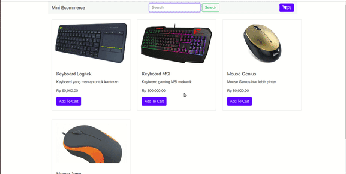

# Tugas DOM Javascript
 

## Target
- Mengerti tentang Selektor pada DOM
- Mengerti dan mengaplikasikan event pada DOM  

## Petunjuk Pengerjaan 
Terdapat sebuah template html bernama index.html. Halaman ini adalah sebuah mini-ecommerce sederhana. Pada halaman tersebut sudah tersedia beberapa element awal yaitu navbar dan bagian content utama. Tugas kamu adalah melengkapi halaman tersebut agar menjadi lebih interaktif menggunakan DOM Javascript. 
<a href="source/dom/index.html" download>index.html</a>  

## Release 0  
Halaman index html ketika pertama diload akan menampilkan seluruh barang yang tersedia di mini-ecommerce. Misalkan terdapat data yang kita peroleh dari Database seperti berikut:  

************

 
var items = [  
    ['001', 'Keyboard Logitek', 60000, 'Keyboard yang mantap untuk kantoran', 'logitek.jpg'], 
    ['002', 'Keyboard MSI', 300000, 'Keyboard gaming MSI mekanik', 'msi.jpg'], 
    ['003', 'Mouse Genius', 50000, 'Mouse Genius biar lebih pinter', 'genius.jpeg'], 
    ['004', 'Mouse Jerry', 30000, 'Mouse yang disukai kucing', 'jerry.jpg'] 
] 
 

******
 
Tampilkanlah setiap barang tersebut dengan menggunakan Card yang sudah ditentukan seperti berikut: 
<a href="source/dom/card.html" download>card.html</a>  
Petunjuk : Lakukan looping/perulangan terhadap items yang menghasilkan element Card. Setiap Card berisi data sesuai dengan data di variable items.  

File gambar-gambar item bisa kamu download dari sini : 
<a href="source/dom/assets.zip" download>download assets</a>  

## Release 1  
Ketika semua item berhasil tampil selanjutnya kamu diminta agar User dapat melakukan pencarian item melalui form search pada Navbar. Misalkan ketika User mengetik “Mouse” maka akan ditampilkan item Mouse saja. Jika mengetik “Keyboard” maka akan ditampilkan item Keyboard saja. Selain itu tidak akan menampilkan apapun.

Petunjuk : Tangkaplah event submit pada form id=”formItem”. Di dalam event tersebut dapatkan value dari input search. Setelah itu lakukan filter pada items yang nama itemnya sesuai dengan kata kunci pencarian.  

## Release 2 (Opsional) 
Pada Card Item terdapat button “Tambahkan ke Keranjang”, buatlah event ketika diklik button tersebut maka pada button Icon keranjang di navbar (id = "cart") akan bertambah +1.  

## Simulasi Hasil Release 0 dan Release 1 
Berikut contoh hasil untuk release 0 dan release 1: 
 
Release 0 dan Release 1 : Menampilkan barang dengan DOM dan memfilternya melalui form search  

## Simulasi Hasil Release 2 
Berikut contoh hasil untuk release 2 (Opsional) 
 
Release 2: menambahkan barang ke keranjang
