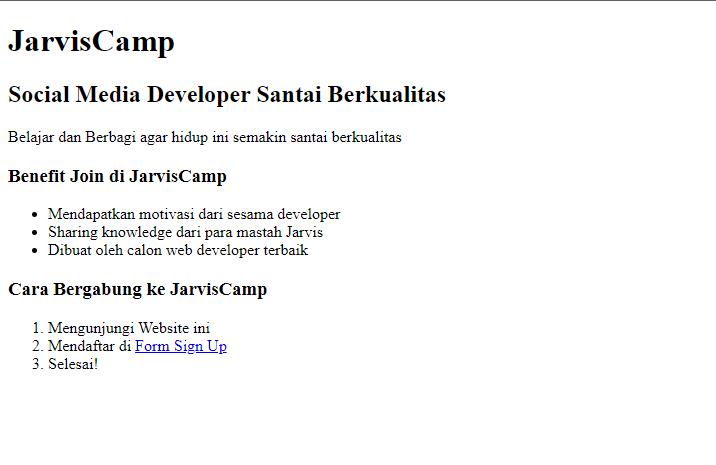
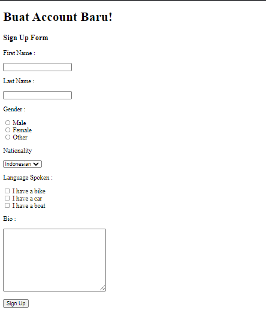
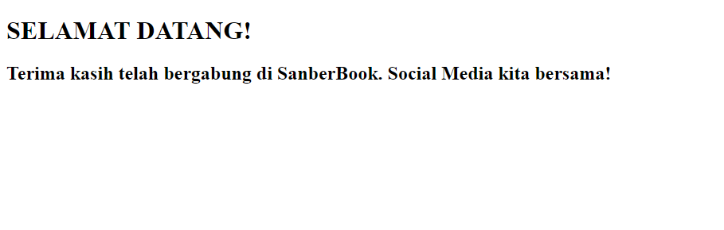

# Tugas HTML
 

## Target
- Menguasai dasar-dasar HTML
- Menguasai tag-tag pada HTML  

## Petunjuk Pengerjaan  

### Buat File HTML index  

Buatlah sebuah file index.html yang akan menampilkan halaman seperti berikut:
  

### Buat halaman form  

Buatlah file baru bernama form.html yang berisi form seperti berikut :
nb: Gunakan Element Form untuk Menuju ke welcome.html  
  

### Buat halaman selamat datang  

Setelah user berhasil mendaftar, berikan halaman welcome.html yang memberikan ucapan selamat datang seperti berikut:
  
