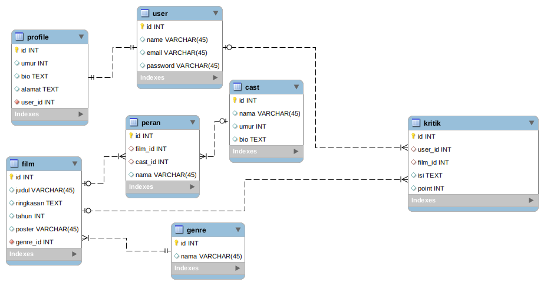

# Mengatur Database dengan Migration
  

## Buat Database Menggunakan Migration Laravel
 
Catatan : Tugas migration ini boleh disimpan di project Laravel tugas kemarin (melanjutkan).
  
Berikut ini adalah gambaran dari database yang akan dibuat menggunakan migration :
 

 
Catatan:
 
Nama table dan nama column boleh berbeda, tidak mesti sama dengan yang di contoh.
  
Untuk table user bisa menggunakan migration bawaan laravel 
$table->timestamps();

  

NB: file migration bawaan laravel jangan di hapus karena akan digunakan di materi laravel auth