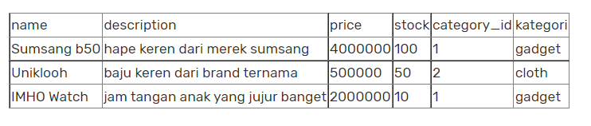

# Berlatih SQL
 

Tugaskali ini kamu diminta untuk menuliskan SQL Queries untuk membuat database, membuat table, mengisi data ke table, mengambil dan mengubah data ke table. Tulislah jawaban jawaban ke dalam sebuah file dengan nama jawaban.txt.
  

## Soal 1 Membuat Database
Buatlah database dengan nama “myshop”. Tulislah di text jawaban pada nomor 1.  

## Soal 2 Membuat Table di Dalam Database
Buatlah tabel – tabel baru di dalam database myshop sesuai data-data berikut.  
 

 

 
tuliskan jawaban pada file text jawaban dengan nomor 2.  

## Soal 3 Memasukkan Data pada Table
Masukkanlah data data berikut dengan perintah SQL “INSERT INTO . . ” ke dalam table yang sudah dibuat pada soal sebelumnya.  

 

 

  

## Soal 4 Mengambil Data dari Database
- Mengambil data users 
Buatlah sebuah query untuk mendapatkan data seluruh user pada table users. Sajikan semua field pada table users KECUALI password nya.  
- Mengambil data items 
a. Buatlah sebuah query untuk mendapatkan data item pada table items yang memiliki harga di atas 1000000 (satu juta). 
b. Buat sebuah query untuk mengambil data item pada table items yang memiliki name serupa atau mirip (like) dengan kata kunci “uniklo”, “watch”, atau “sang” (pilih salah satu saja).  

- Menampilkan data items join dengan kategori 
Buatlah sebuah query untuk menampilkan data items yang dilengkapi dengan data nama kategori di masing-masing items (gunakan join). Berikut contoh tampilan data yang ingin didapatkan 

 
 

## Soal 5 Mengubah Data dari Database
Ubahlah data pada table items untuk item dengan nama sumsang b50 harganya (price) menjadi 2500000. Masukkan query pada text jawaban di nomor ke 5.
    

### Format tugas
buat file jawaban.txt dan copy sintax sql di jawaban.txt 
contoh:  
1. Buat Database 
create Database nama_database  

2. Membuat Table di Dalam Database 
........